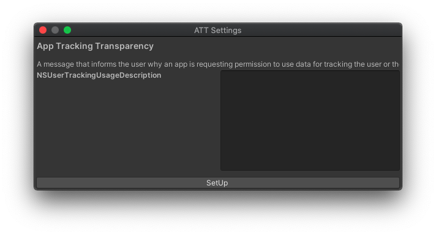
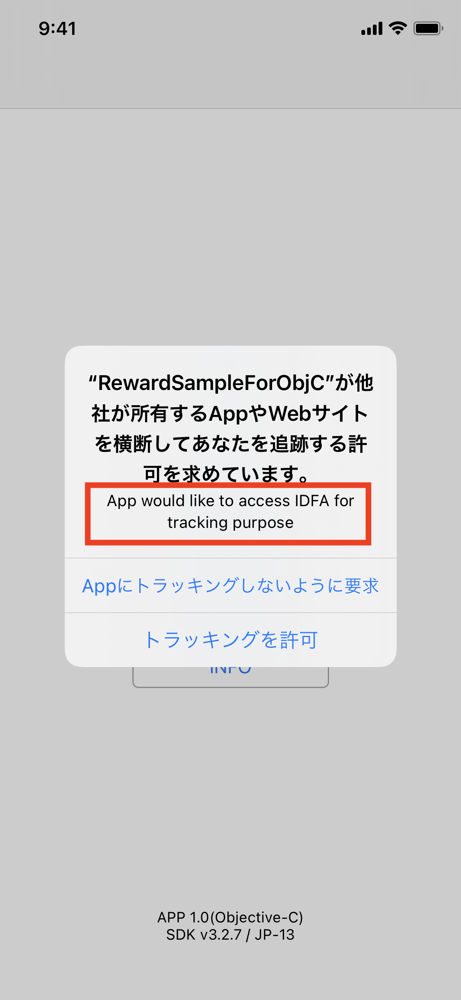

# SS App Tracking Transparency for Unity
## 実装
### 利用可能かどうかを取得する
```cs
var available = Supership.ATT.TrackingManager.IsAvailable;
```
info.plistに`NSUserTrackingUsageDescription`がない場合や、iOS14以降でない端末の場合に**false**となります。

必ず、この値を取得してからご利用ください。

## トラッキングの認証ステータスの取得
```cs
var status = Supership.ATT.TrackingManager.TrackingAuthorizationStatus;
```

トラッキングの認証ステータスの一覧
|ステータス||
|---|---|
|NotSupported|サポート対象外|
|NotDetermined|承認リクエストをユーザがまだ受け取っていない|
|Restricted|アクセスが制限されている|
|Denied|アクセスの承認をユーザが拒否した|
|Authorized|アクセスをユーザが承認した|

※iOS14以前のバージョンやiOS以外のプラットフォームではNotSupportedを返却します。

### ユーザ認証のリクエスト
トラッキングのユーザ認証のリクエストを行います。

初回のみダイアログが表示されます。

```cs
if (Supership.ATT.TrackingManager.IsAvailable)
{
    Supership.ATT.TrackingManager.RequestTrackingAuthorization(status =>
    {
        Debug.Log($"status:{status}");
    });
}
```

## ATTのダイアログに表示する文言を設定する
Supership>ATT SettingsメニューからATT Settingsのウインドウを起動できます。

  

NSUserTrackingUsageDescriptionに設定するメッセージは以下のATTのダイアログ上に表示されます。



`SetUp`ボタンを押すと設定が反映されます。(PlayerSettingsに保存されます)

※この設定がないとATTのダイアログが表示されませんので、ご注意ください。